# SEO Audit Report

SEO Blog Project

## Overview

This audit evaluates the technical SEO implementation of the SEO Blog Project. The website demonstrates fundamental SEO practices including metadata optimization, crawl management, internal linking, structured data implementation, and responsive design.

Live Website
https://janchristopherbuen.github.io/seo-blog-project/

---

# 1. Title Tag

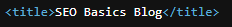

## Analysis

The page includes a descriptive HTML title tag.

Example:

<title>SEO Basics Blog</title>

Title tags communicate the topic of a page to search engines and influence how the page appears in search results.

---

# 2. Meta Description

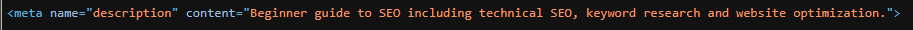

## Analysis

The page implements a meta description summarizing the page content.

Example:

<meta name="description" content="Beginner guide to SEO including technical SEO, keyword research and website optimization.">

Meta descriptions improve search result snippets and increase click-through rates.

---

# 3. Heading Structure

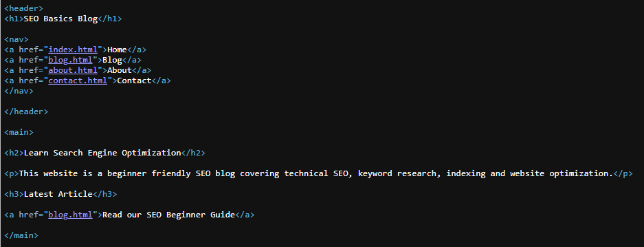

## Analysis

The page uses a clear heading hierarchy.

H1: SEO Basics Blog
H2: Learn Search Engine Optimization
H3: Latest Article

Structured headings help search engines understand content hierarchy and improve accessibility.

---

# 4. Canonical Tag

## Analysis

A canonical tag is implemented to define the preferred version of the page.

Example:

<link rel="canonical" href="https://janchristopherbuen.github.io/seo-blog-project/">

Canonical tags help prevent duplicate content issues and consolidate ranking signals.

---

# 5. Internal Linking Structure

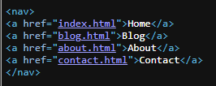

## Analysis

The site includes internal navigation linking the following pages:

* Home
* Blog
* About
* Contact

Internal links help search engines crawl pages and understand the website structure.

---

# 6. Open Graph Metadata

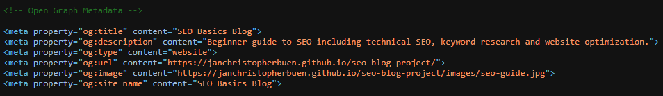

## Analysis

Open Graph metadata is implemented to control how pages appear when shared on social media.

Properties implemented:

* og:title
* og:description
* og:type
* og:url
* og:image

These tags improve social media preview appearance.

---

# 7. Robots.txt Configuration

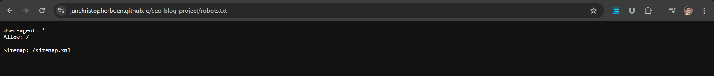

## Analysis

The robots.txt file allows search engine crawlers to access the website and references the sitemap.

Example:

User-agent: *
Allow: /
Sitemap: /sitemap.xml

This helps search engines efficiently discover and crawl site content.

---

# 8. XML Sitemap

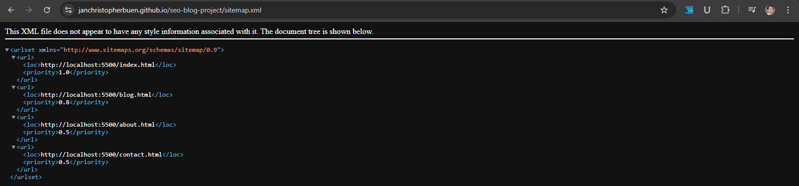

## Analysis

The XML sitemap lists website URLs and helps search engines discover pages for indexing.

Sitemaps improve crawl coverage, especially for small or new websites.

---

# 9. Structured Data (Schema Markup)

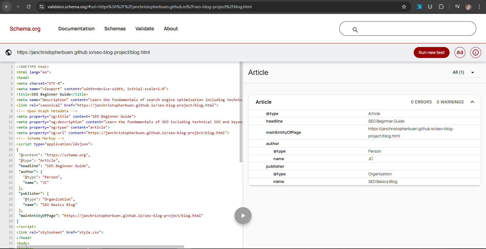

## Analysis

Structured data using JSON-LD format is implemented to define article content.

Schema type used:

Article

Properties implemented:

* headline
* author
* publisher
* mainEntityOfPage

Validation confirms the schema is implemented correctly without errors.

Structured data helps search engines understand content and may enable rich search features.

---

# 10. Lighthouse Technical Audit

## Analysis

A Lighthouse audit was conducted using Chrome DevTools.

Results:

Performance: 93
Accessibility: 100
Best Practices: 100
SEO: 100

These results indicate the website follows recommended web performance and SEO implementation standards.

---

# 11. Responsive Design Validation

## Desktop View

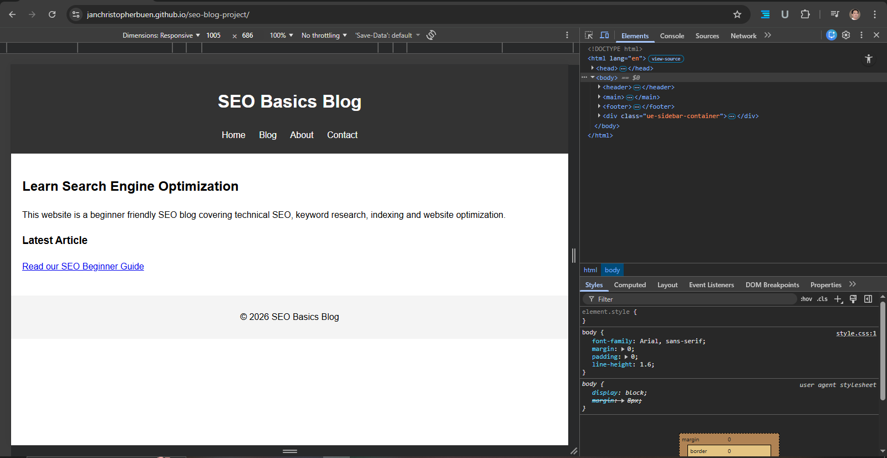

### Analysis

The website displays a full layout on desktop screens. Navigation and content remain clearly structured and readable.

---

## Tablet View

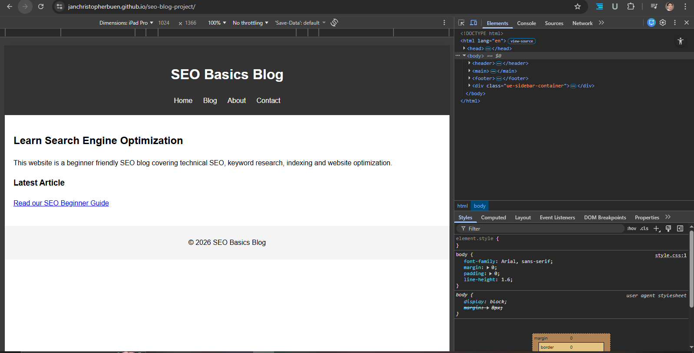

### Analysis

On tablet screens the layout scales appropriately while maintaining readability and navigation accessibility.

---

## Mobile View

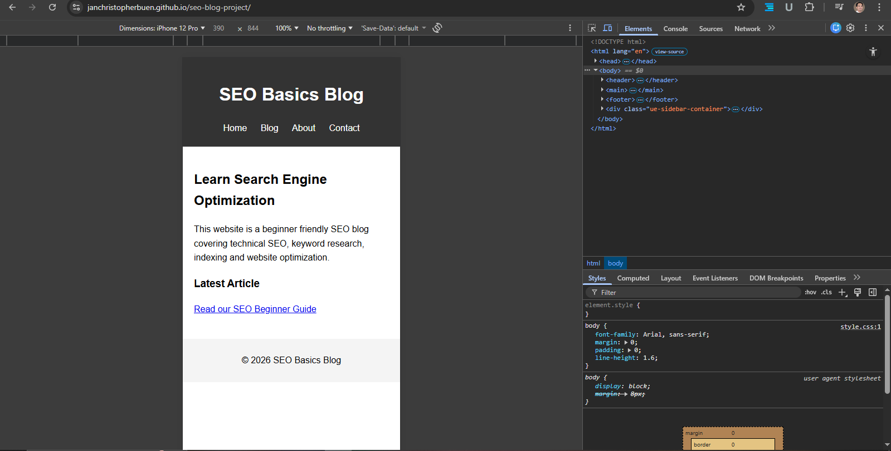

### Analysis

The website adapts to smaller mobile screens while maintaining content structure and usability.

Responsive design ensures accessibility across multiple devices and improves overall user experience.

---

# Conclusion

The SEO Blog Project demonstrates the implementation of fundamental technical SEO practices including:

* metadata optimization
* semantic HTML structure
* internal linking architecture
* crawl management using robots.txt
* XML sitemap implementation
* structured data markup
* responsive design support
* technical validation through Lighthouse audits

This project demonstrates practical application of technical SEO concepts within a static website environment.
