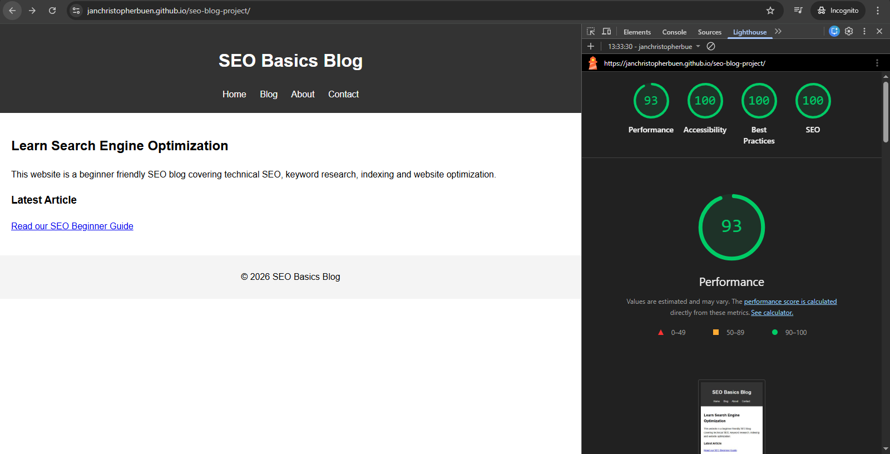

# Technical SEO Audit Report

Project: SEO Basics Blog
Live Site: https://janchristopherbuen.github.io/seo-blog-project/

## Overview

This project demonstrates the implementation of foundational technical SEO elements on a static website hosted with GitHub Pages. The objective is to ensure that the site is crawlable, indexable, and structured according to search engine best practices.

---

# Lighthouse Audit Results

| Category       | Score |
| -------------- | ----- |
| Performance    | 93    |
| Accessibility  | 100   |
| Best Practices | 100   |
| SEO            | 100   |

Screenshot:

---

# Crawlability

Robots.txt implemented and publicly accessible:

/robots.txt

Configuration:

User-agent: *
Allow: /

This allows search engine crawlers to access and crawl all pages.

---

# Indexability

XML sitemap implemented:

/sitemap.xml

URLs included:

* index.html
* blog.html
* about.html
* contact.html

The sitemap provides a clear list of indexable pages.

---

# Canonicalization

Each page includes a canonical URL to prevent duplicate indexing.

Example:

<link rel="canonical" href="https://janchristopherbuen.github.io/seo-blog-project/blog.html">

---

# On-Page SEO Elements

Each page contains:

* Title tag
* Meta description
* Semantic heading structure
* Internal navigation links

Example structure:

H1 → Site title
H2 → Page topic
H3 → Article section

---

# Social Metadata

Open Graph metadata implemented for social sharing.

Tags included:

* og:title
* og:description
* og:type
* og:url
* og:image

---

# Structured Data

JSON-LD schema markup implemented.

Schema types used:

* WebSite
* Article

Validated using Schema.org validator.

---

# Internal Linking Structure

Navigation links connect all pages:

Home → Blog → About → Contact

This structure supports efficient crawling and logical site architecture.

---

# Hosting

The site is deployed using GitHub Pages.

Live URL:
https://janchristopherbuen.github.io/seo-blog-project/

---

# Conclusion

The website successfully demonstrates core technical SEO practices including crawlability, indexability, canonicalization, structured metadata, and validation through Lighthouse. The project serves as a practical example of entry-level technical SEO implementation.
